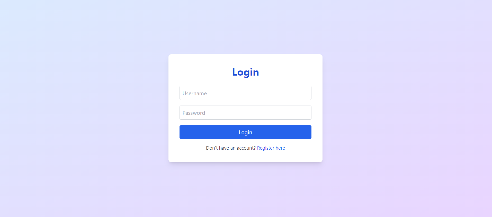
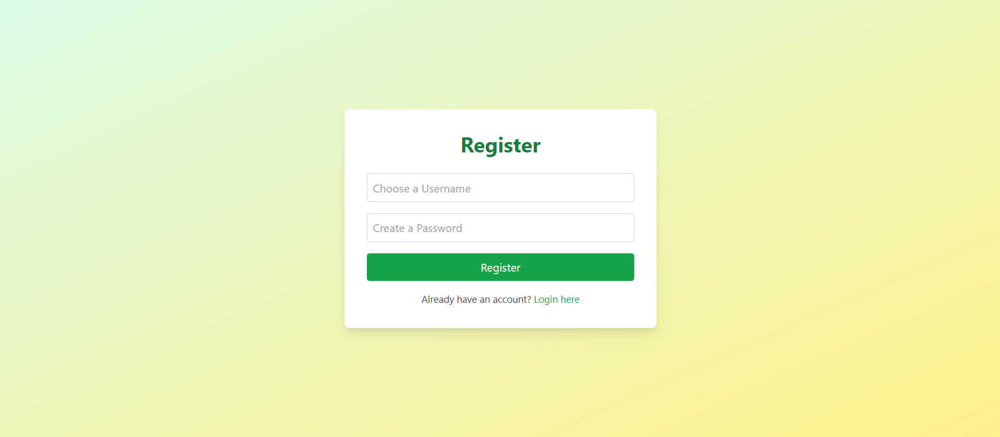
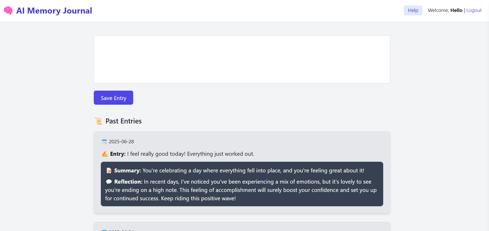

# 🧠 AI Memory Journal

A journaling web app that uses the **Groq LLM API** to generate personalized summaries, emotional reflections, and detect mood trends from daily journal entries.

---

## 🔗 Live Demo

[🌐 View the Deployed App](https://ai-memory-journal.onrender.com/)

---

## ✨ Features

- 🛡️ Secure user registration, login, and session management  
- ✍️ Real-time AI-generated summaries and emotional reflections  
- 📈 Mood analysis and tracking based on recent trends  
- 💾 SQLite-powered lightweight backend (ephemeral on Render)  
- 🎨 Minimalist UI with TailwindCSS  
- 🚀 One-click deployable (Render compatible)  

---

## 🛠 Tech Stack

- **Backend:** Python, Flask, SQLite  
- **Frontend:** HTML, Jinja2, TailwindCSS  
- **AI Integration:** Groq API (LLaMA 3.3 70B via chat completion endpoint)  
- **Deployment:** Render  
- **Version Control:** Git & GitHub  

---

## 🚀 Getting Started

### 1. Clone the repository
```bash
git clone https://github.com/Tanishq2540/ai-memory-journal.git
cd ai-memory-journal
```

### 2. Install dependencies
```bash
pip install -r requirements.txt
```

### 3. Add your Groq API key  
Create a `.env` file in the root directory and add:
```env
GROQ_API_KEY=your_groq_api_key
```

### 4. Initialize the database
```bash
python init_db.py
```

### 5. Start the Flask server
```bash
python app.py
```

Visit [http://127.0.0.1:5000](http://127.0.0.1:5000) in your browser.

---

## 📂 Project Structure

```
ai-memory-journal/
├── app.py               # Flask app and routes
├── groq_helper.py       # Handles Groq API requests & parsing
├── init_db.py           # Creates users and journal_entries tables
├── templates/           # HTML templates (Jinja2)
│   ├── login.html
│   ├── register.html
│   └── journal.html
├── static/              # CSS and other assets
│   └── styles.css
├── .env                 # (Not committed) contains GROQ_API_KEY
├── requirements.txt     # Python dependencies
└── README.md
```

---

## 🧠 Example Prompt

**Journal Entry:**
> I feel really good today! Everything just worked out.

**AI Summary:**
> You're celebrating a day where everything fell into place, and you're feeling great about it!

**AI Reflection:**
> In recent days, I've noticed you've been experiencing a mix of emotions, but it's lovely to see you're ending on a high note. This feeling of accomplishment will surely boost your confidence and set you up for continued success. Keep riding this positive wave!

---

## 🖼️ Screenshots

> Add actual images to the `screenshots/` folder and commit them to make these work.

  
  


---

## 🧾 License

This project is licensed under the [MIT License](LICENSE).
